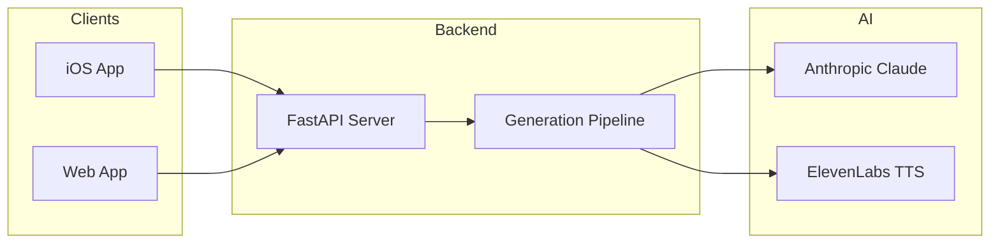
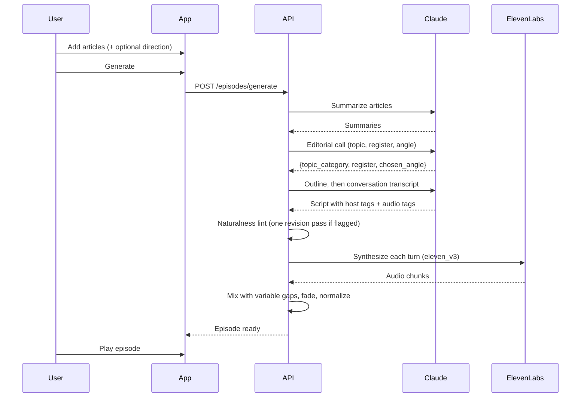

# The Signal

AI-powered podcast generator that turns articles into engaging audio episodes.



## Components

| Directory | Description | Tech Stack |
|-----------|-------------|------------|
| `TheSignal/` | iOS app | Swift, SwiftUI, SwiftData |
| `signal-backend/` | API server | Python, FastAPI |
| `signal-web/` | Web app | React, TypeScript, Vite |

## Quick Start

### Backend

```bash
cd signal-backend
cp .env.example .env
# Add your API keys to .env

pip install -r requirements.txt
uvicorn main:app --reload
```

### Web Frontend

```bash
cd signal-web
npm install
npm run dev
```

Open http://localhost:5173

### iOS App

Open `TheSignal/` in Xcode and run on simulator or device. Set the backend
URL in the app's Settings tab (use your Mac's LAN IP on a real device).

## Configuration

All secrets live in **one** `.env`, used only by the backend. Put it either at
the repo root or in `signal-backend/` (the backend reads both; the local one
wins). The web app needs no env file locally (Vite proxies to the backend) and
the iOS app configures its backend URL in-app.

| Key | Required | Purpose |
|-----|----------|---------|
| `ANTHROPIC_API_KEY` | yes | Summaries, enrichment, script writing |
| `ELEVENLABS_API_KEY` | yes | Text-to-speech |
| `FIRECRAWL_API_KEY` | no | Robust article extraction (JS-rendered and most paywalled pages) |

Without Firecrawl, extraction falls back to plain readability parsing, which
fails on JS-heavy sites; URL submissions that yield under 80 words are
rejected with a clear error rather than producing thin episodes.

## Deploying

The backend deploys to Render via the `render.yaml` blueprint (Docker +
persistent disk for the knowledge base and audio). In the Render dashboard:
New → Blueprint → select this repo, then fill in the API keys it prompts for.
`SIGNAL_API_TOKEN` is auto-generated and required on every API/media request
(`Authorization: Bearer` or `?token=`) so strangers can't spend your keys.

Frontend on Vercel: set `VITE_API_URL` to the Render URL and `VITE_API_TOKEN`
to the generated token, then redeploy. iOS: enter both in the Settings tab.

## Features

### Knowledge Base
Articles persist in SQLite (`signal-backend/data/signal.db`) and are enriched on
ingest with a summary, topic tags, and entities. Episode scripts automatically pull
in related background articles and reference what recent episodes covered, so the
show builds continuity over time.

- `GET /api/articles/search?q=...` — full-text search across the knowledge base
- `GET /api/articles/{id}/related` — articles related by topic/entity overlap
- `POST /api/discover` — web-search a topic (Firecrawl) and return candidate
  articles to queue; the web app's "Discover topic" button drives this

### Chapter Manifest (adaptive playback)
Episodes are scripted in chapters (`intro` / `core` / `optional` / `closer`) and
mixed into one audio file per chapter alongside the full episode MP3. Optional
chapters are self-contained tangents a player can skip, so playback can be fit
to a walk or commute: play chapters in order, drop or keep optionals to match
the remaining time, always end on the closer.

- `GET /api/episodes/{id}/manifest` — chapters with roles, measured durations,
  start offsets into the full episode, and per-chapter audio URLs

### Walk Mode (iOS)
Tap **Walk** in the player, tell it how long you have, and the episode is fit
to your time: required chapters always play, bonus chapters are kept while
they fit, and playback rate is nudged (0.95–1.10x) so the closer lands as you
get home. The plan re-evaluates at every chapter boundary against the
wall-clock deadline — pause mid-walk and it adapts by dropping a bonus
chapter or speeding up slightly.

**Destination mode**: instead of a timer, search for where you're walking to.
The walking ETA (MapKit) sets the episode length, and live location updates
slide the deadline while you walk — walk slower and a bonus chapter comes
back, faster and playback tightens so the closer lands as you arrive.
Requires `NSLocationWhenInUseUsageDescription` in the app target's Info
settings.

### Topic-Aware Editorial (no style knobs)
There are no user-facing style dimensions. After enrichment, an editorial
classifier reads the articles and decides how the episode should sound —
`{topic_category, register, chosen_angle, framing_note, rationale}` — stored
on the episode for inspection. Specialist framing only happens when the story
demands it (an earnings report can get investor vocabulary; a World Cup final
never will). Steer the angle with the free-text **Direction** field.

### Persistent Hosts
Every episode is the same two people: **Maya** (ex-wire-service journalist,
the explainer who lands the numbers) and **Dev** (ex-engineer generalist, the
skeptic who asks what the listener is thinking). Personas live in
`signal-backend/personas.py` with their own voices and voice settings; the
topic changes how they talk, never who they are.

### Naturalness Pipeline
Scripts are written as conversation transcripts (varied turn lengths, genuine
questions, light disagreement, interruptions, callbacks), then checked by a
rules-based lint — uniform turns, missing reactions, register mismatches
(financial jargon in a non-financial episode), unspeakable tokens like
"2.8T", stock phrases — which triggers at most one revision pass.

### Sound & Music
TTS uses **ElevenLabs v3** with inline audio tags (`[laughs]`, `[sighs]`,
`[curious]`) written by the script model and rendered as real delivery, with
per-host voice settings. Gaps between turns are variable — short after
reactions and interruptions, longer at chapter shifts — instead of a fixed
silence. Set `ELEVENLABS_MODEL=eleven_multilingual_v2` to roll back to v2
(audio tags are stripped automatically). Toggle **Intro Theme Music** to open
each episode with a short sting that fades under the first line — generated
once via the ElevenLabs Music API and cached, or drop your own at
`signal-backend/data/theme.mp3`.

### Voice Selection
9 ElevenLabs voices with per-host settings (stability, clarity, style), and
per-host overrides via `voice_config`.

### Audio Production
- Variable conversational gaps (tight / natural / spacious base)
- Fade in/out transitions
- Volume normalization

## Architecture



## API Endpoints

| Method | Endpoint | Description |
|--------|----------|-------------|
| GET | `/api/articles` | List articles |
| POST | `/api/articles` | Add article |
| DELETE | `/api/articles/:id` | Remove article |
| GET | `/api/episodes/voices` | List available voices |
| POST | `/api/episodes/generate` | Start generation |
| GET | `/api/episodes/:id` | Get episode status |
| GET | `/api/episodes/:id/audio` | Download audio |

## Environment Variables

```bash
# signal-backend/.env
ANTHROPIC_API_KEY=sk-ant-...
ELEVENLABS_API_KEY=...
STORAGE_PATH=./data
```

## License

MIT
