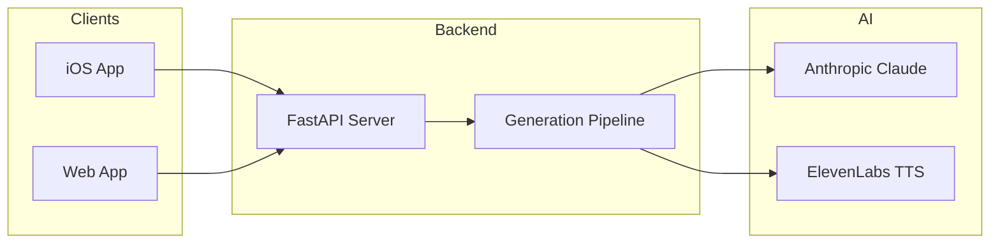
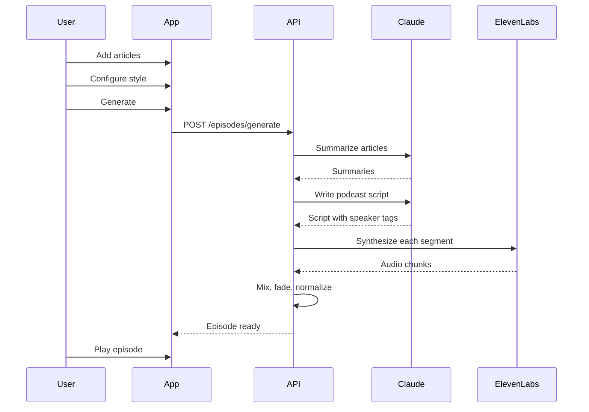

# The Signal

AI-powered podcast generator that turns articles into engaging audio episodes.



## Components

| Directory | Description | Tech Stack |
|-----------|-------------|------------|
| `TheSignal/` | iOS app | Swift, SwiftUI, SwiftData |
| `signal-backend/` | API server | Python, FastAPI |
| `signal-web/` | Web app | React, TypeScript, Vite |

## Quick Start

### Backend

```bash
cd signal-backend
cp .env.example .env
# Add your API keys to .env

pip install -r requirements.txt
uvicorn main:app --reload
```

### Web Frontend

```bash
cd signal-web
npm install
npm run dev
```

Open http://localhost:5173

### iOS App

Open `TheSignal/` in Xcode and run on simulator or device.

## Features

### Customizable Style
8 independent dimensions to shape your podcast:

- **Depth**: Briefing / Deep Dive / Synthesis
- **Tone**: Casual / Polished / Debate / Technical
- **Lens**: Investor / Engineer / Macro / General
- **Pacing**: Rapid / Measured / Variable
- **Humor**: Serious / Dry / Playful / Roast
- **Audience**: Insider / Informed / Curious
- **Structure**: Narrative / Ranked / Thematic / Contrarian
- **Closer**: Actionable / Philosophical / Prediction / Question

### Voice Selection
9 ElevenLabs voices with per-speaker settings:
- Stability (consistency)
- Clarity (similarity boost)
- Style (expressiveness)

### Audio Production
- Configurable gaps between segments
- Fade in/out transitions
- Volume normalization

## Architecture



## API Endpoints

| Method | Endpoint | Description |
|--------|----------|-------------|
| GET | `/api/articles` | List articles |
| POST | `/api/articles` | Add article |
| DELETE | `/api/articles/:id` | Remove article |
| GET | `/api/episodes/voices` | List available voices |
| POST | `/api/episodes/generate` | Start generation |
| GET | `/api/episodes/:id` | Get episode status |
| GET | `/api/episodes/:id/audio` | Download audio |

## Environment Variables

```bash
# signal-backend/.env
ANTHROPIC_API_KEY=sk-ant-...
ELEVENLABS_API_KEY=...
STORAGE_PATH=./data
```

## License

MIT
