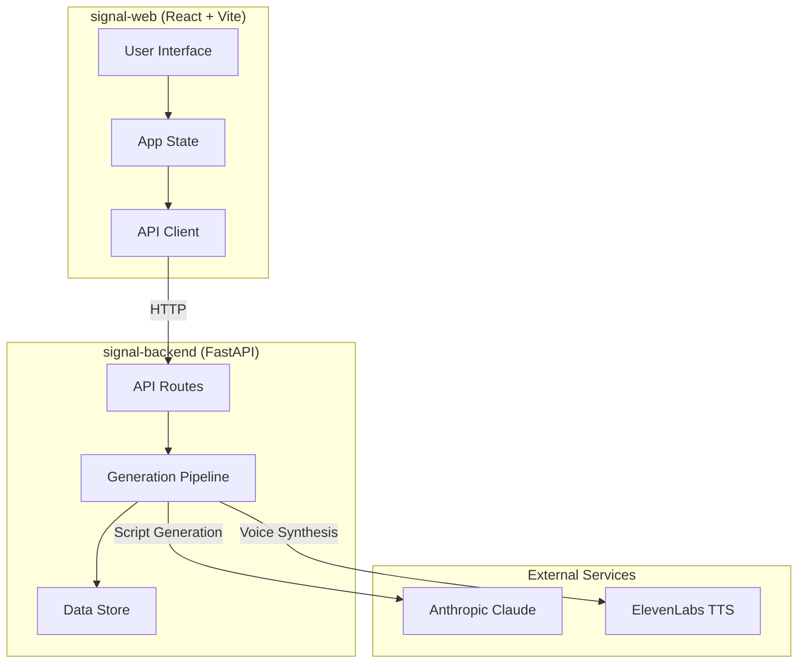
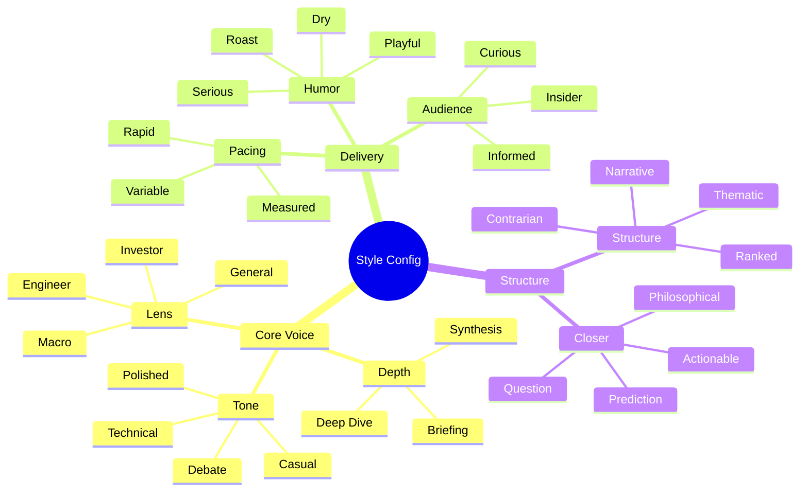
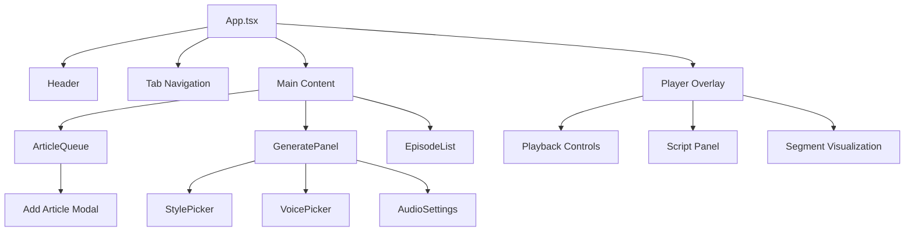
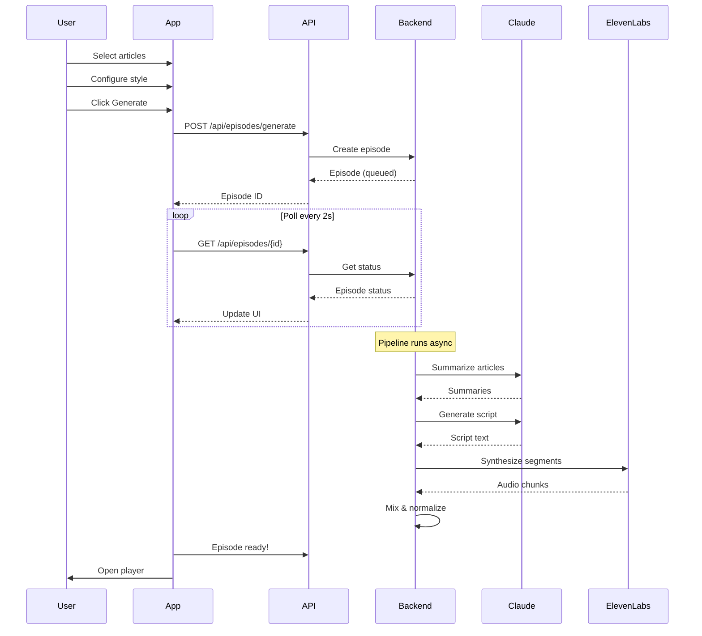
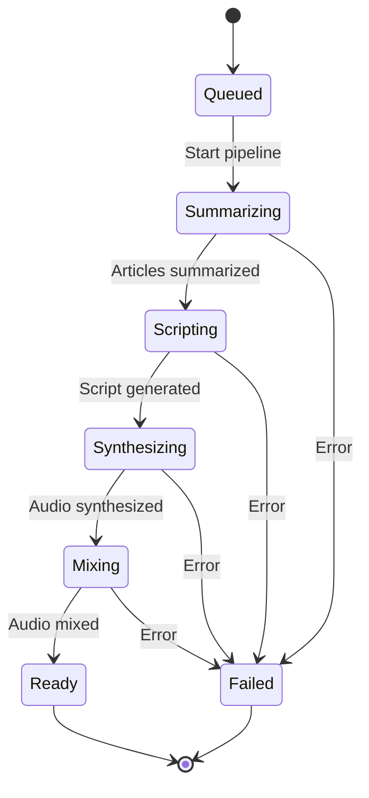
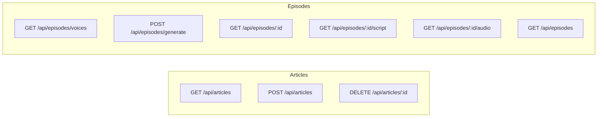
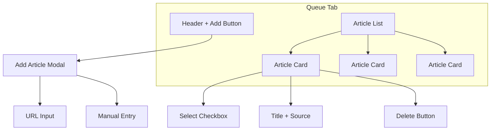
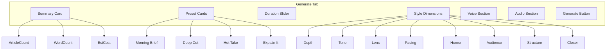
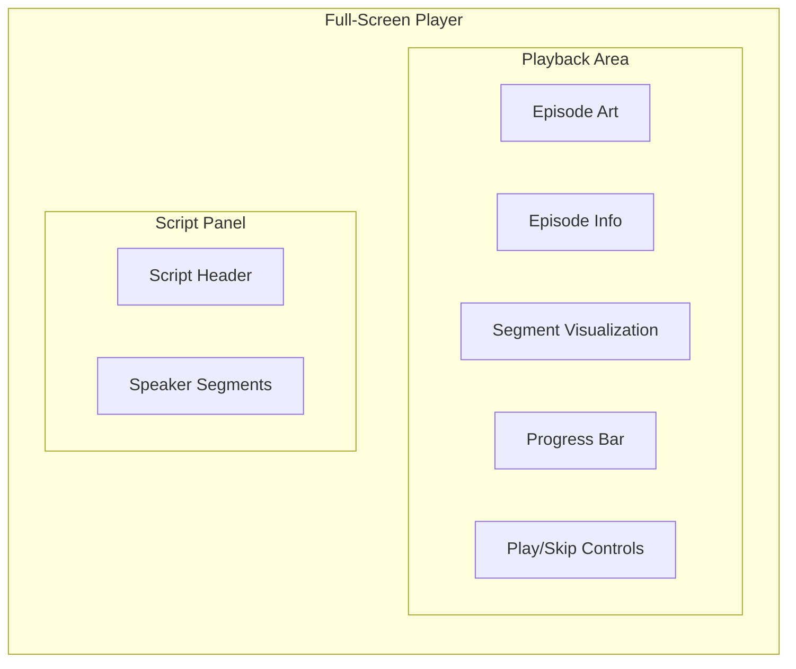

# The Signal - Web Frontend

A React web application for generating AI-powered podcast episodes from articles. This is the desktop/laptop companion to the iOS app.

## Overview



## Features

### Article Queue
Add articles via URL or paste content directly. Select articles to include in your podcast episode.

### Style Configuration
Customize your podcast with 8 independent dimensions:



### Voice Customization
Select from 9 ElevenLabs voices and adjust per-speaker settings:

| Setting | Range | Description |
|---------|-------|-------------|
| Stability | 0-100% | Higher = more consistent delivery |
| Clarity | 0-100% | Higher = clearer voice reproduction |
| Style | 0-100% | Higher = more expressive performance |

### Audio Production
Fine-tune the final output:

- **Gap Duration**: 100-1000ms between segments
- **Fade In/Out**: 0-500ms smooth transitions
- **Normalize**: Even out volume levels across speakers

## Architecture

### Component Structure



### Data Flow



### Generation Pipeline



## Getting Started

### Prerequisites

- Node.js 18+
- Backend running on `localhost:8000`

### Installation

```bash
# Install dependencies
npm install

# Start development server
npm run dev
```

### Development

```bash
# Run dev server with hot reload
npm run dev

# Type check
npm run build

# Preview production build
npm run preview
```

### Environment

The Vite dev server proxies API requests to the backend:

```typescript
// vite.config.ts
server: {
  proxy: {
    '/api': 'http://localhost:8000',
    '/data': 'http://localhost:8000',
  },
}
```

## Project Structure

```
signal-web/
├── src/
│   ├── components/
│   │   ├── ArticleQueue.tsx    # Article management
│   │   ├── AudioSettings.tsx   # Audio production controls
│   │   ├── EpisodeList.tsx     # Episode history
│   │   ├── GeneratePanel.tsx   # Generation workflow
│   │   ├── Player.tsx          # Audio player
│   │   ├── StylePicker.tsx     # Style configuration
│   │   └── VoicePicker.tsx     # Voice selection
│   ├── api.ts                  # Backend API client
│   ├── types.ts                # TypeScript definitions
│   ├── App.tsx                 # Root component
│   ├── App.css                 # (empty - using Tailwind)
│   ├── index.css               # Tailwind + theme
│   └── main.tsx                # Entry point
├── index.html
├── vite.config.ts
├── tsconfig.json
└── package.json
```

## API Endpoints



| Endpoint | Method | Description |
|----------|--------|-------------|
| `/api/articles` | GET | List all articles |
| `/api/articles` | POST | Add article (URL or manual) |
| `/api/articles/:id` | DELETE | Remove article |
| `/api/episodes/voices` | GET | List available voices |
| `/api/episodes/generate` | POST | Start generation |
| `/api/episodes/:id` | GET | Get episode status |
| `/api/episodes/:id/script` | GET | Get parsed script |
| `/api/episodes/:id/audio` | GET | Download MP3 |
| `/api/episodes` | GET | List all episodes |

## Tech Stack

| Technology | Purpose |
|------------|---------|
| React 18 | UI framework |
| TypeScript | Type safety |
| Vite | Build tool & dev server |
| Tailwind CSS | Styling |

## Theme

The app uses a dark theme matching the iOS app:

```css
--color-background: #09090b;
--color-surface: #111113;
--color-border: #27272a;
--color-text-primary: #fafafa;
--color-text-secondary: #a1a1aa;
--color-text-muted: #52525b;
--color-accent-blue: #0a84ff;
--color-accent-purple: #bf5af2;
```

## User Interface

### Queue Tab


### Generate Tab


### Player


## License

MIT
